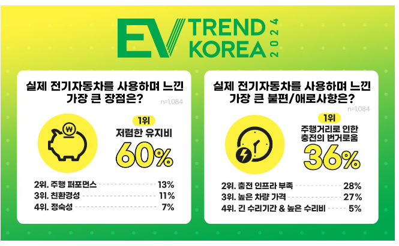
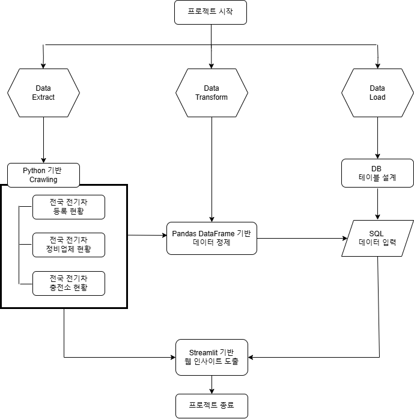
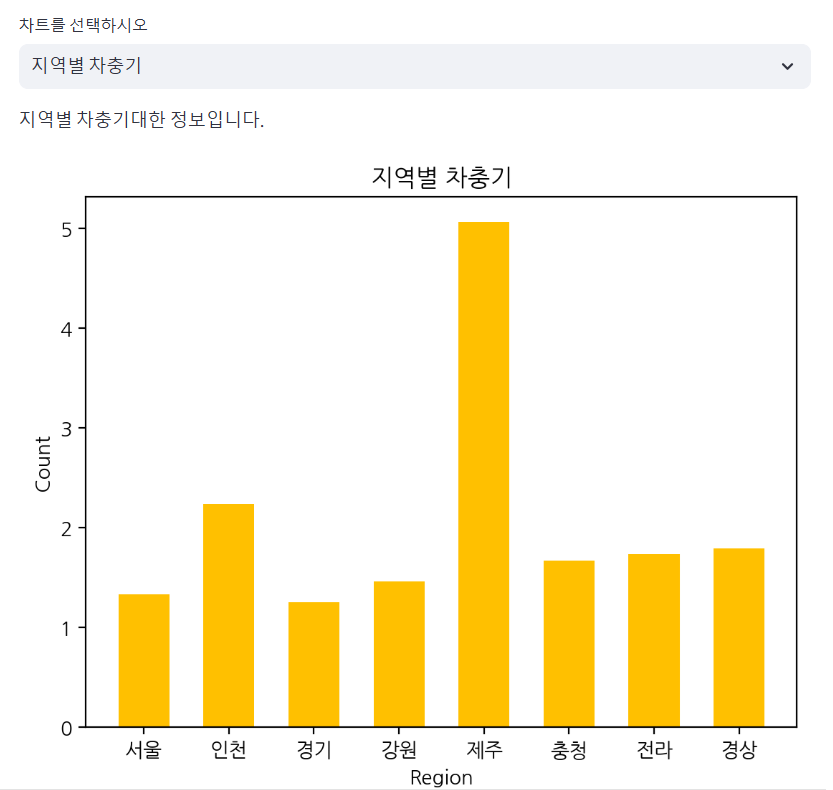
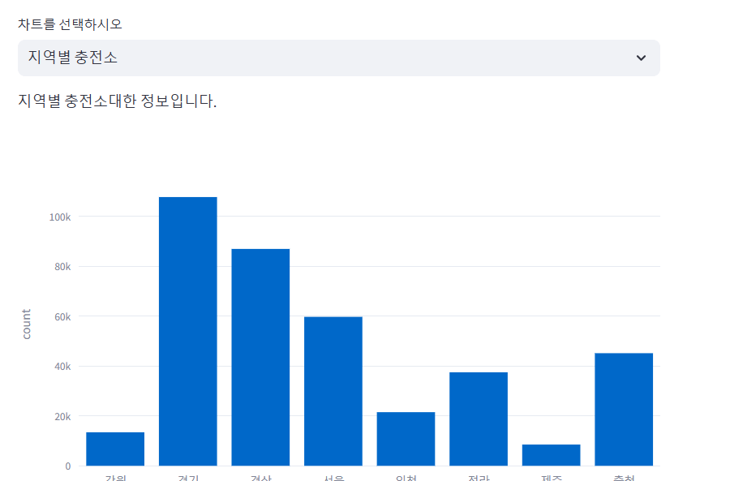
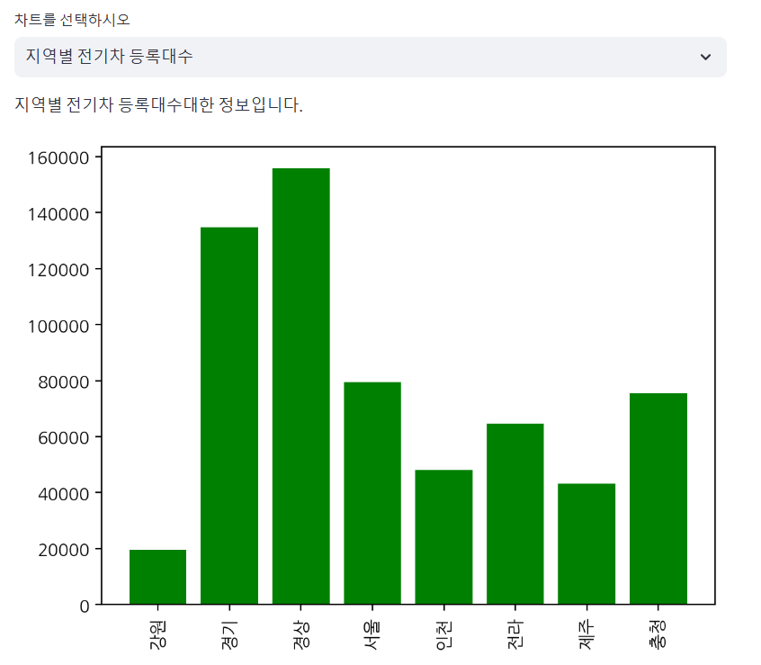
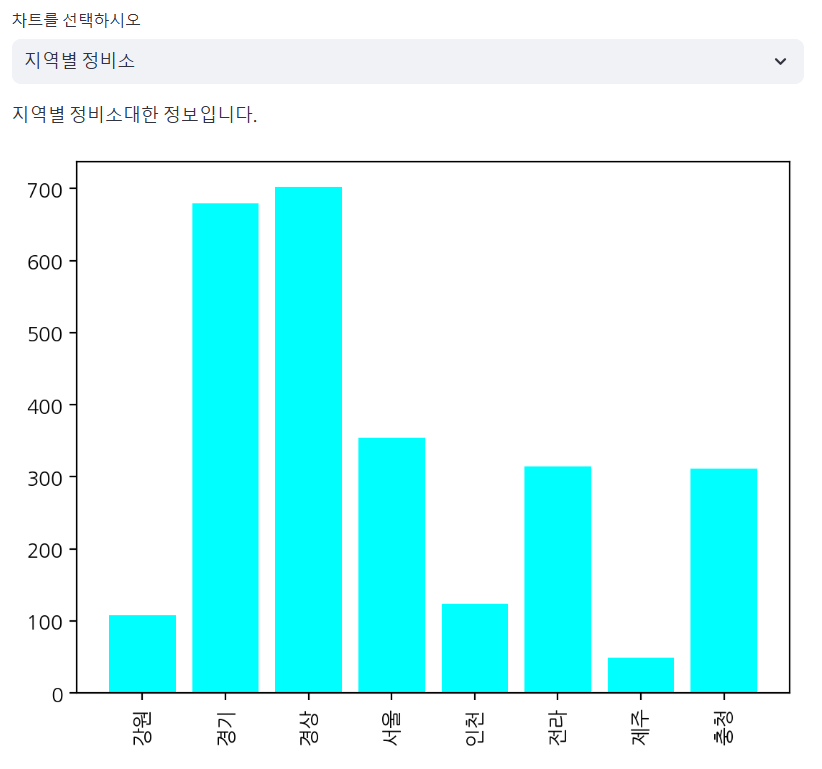
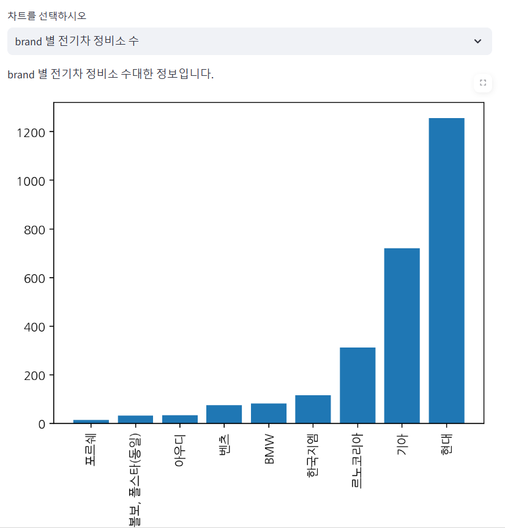

<h3 align="center"> 👋SKN07-1st-Mini Project-4Team👋 </h3>
<br>

## 전기차 통합 정보 사이트 제공
> **팀원 : 김재혁, 정승연, 이재철, 김서진**
><br/> **프로젝트 기간 : 2024.11.13 ~ 2024.11.14** 
<br>

## 1. 프로젝트 개요 및 소개
국내 전기차 판매량이 60만대를 돌파하며 전 세계적으로 전기차 열풍이 돌고 있습니다. 국토교통부에 따르면 2024년 상반기에 등록된 전기차 누적 대수는 60만대가 넘었으며, 매년 10만대 이상 증가하고 있습니다. 전 세계 자동차 판매량의 20% 이상을 전기차가 차지하게 되어 향후 도로 운송을 위한 석유 수요를 줄일 수 있을 것이라는 전망이 요구되고 있습니다. 
<br><br>

  

하지만 높은 판매량에 비해, 전기차 이용자들의 애로사항은 증가하고 있습니다. 'EV Trend Korea 2024' 설문조사 결과에 따르면 실제 전기차 이용자들의 불만사항 1,2위는 전기차 충전에 관한 내용임을 확인할 수 있습니다. 이에 따라, 국내 권역을 기준으로 전기차 등록대수, 차충비, 정비업체 등 다양한 데이터 분석을 통해 급증하는 전기차 수요 대비 현 실상에 대한 분석 결과를 제공합니다.
</br>
<br>


## 2. Tech Stack 
>### <span style="color:Black"> Data Pipeline </span>
        

>### <span style="color:cyan"> UI </span>


>### <span style="color:cyan"> Co-Work Tools </span>
   
<br>
<br>

## 3. Flow Chart

<br>

## 4. ER(Entity Relation) 다이어그램

<br>

## 5. 결과 화면 
* **지역 별 차충기**


* **지역 별 충전소**


* **지역 별 전기차 등록 대수**


* **지역 별 전기차 정비소**


* **브랜드 별 전기차 정비소**

<br>

## 6. 디렉토리 구조
```
SKN07-1st-4Team
├─ data
│  ├─ car_charge.pickle
│  ├─ car_charge.pkl
│  ├─ car_region.pickle
│  ├─ car_region.pkl
│  ├─ car_repairshop.pickle
│  ├─ car_repairshop.pkl
│  ├─ charge_car.csv
│  ├─ charge_car_ratio.pkl
│  ├─ electric_car.csv
│  ├─ repair_shop_audi.csv
│  ├─ repair_shop_benz.csv
│  ├─ repair_shop_bmw_refine.csv
│  ├─ repair_shop_hyundai_refine.csv
│  ├─ repair_shop_kia.csv
│  ├─ repair_shop_koreagm.csv
│  ├─ repair_shop_porsche.csv
│  ├─ repair_shop_renault.csv
│  ├─ repair_shop_volvo_refine.csv
│  ├─ result.pickle
│  ├─ result_car_charge.pickle
│  └─ result_car_charge.pkl
├─ image
│  ├─ brand_repair.png
│  ├─ region_charger.png
│  ├─ region_charger_ratio.png
│  ├─ region_eleccar.png
│  └─ region_repair.png
├─ requirements.txt
├─ README.md
└─ src
   ├─ app.py
   ├─ crawl1.py
   └─ insert_db.py
```
<br><br>


